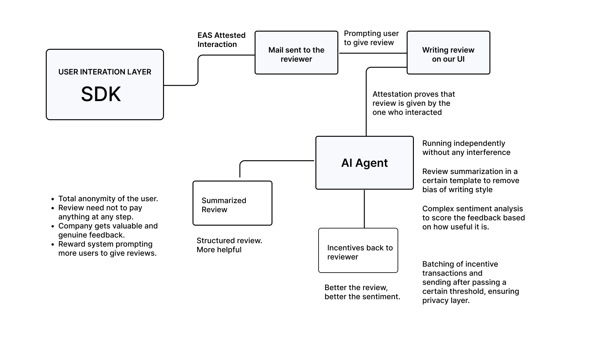

# Mumei - AnonFeedback Solutions

Mumei is a solution for providing anonymous feedback without reviewer revealing his/her identity and service provider ensuring that the feedback is coming from someone who actually has ever used their services.

## Overview
Mumei addresses critical challenges in feedback collection within Web3 by ensuring **user privacy**, offering **fair crypto rewards**, and providing **actionable insights** for companies. Traditional feedback systems often compromise user anonymity or fail to fairly compensate contributors. Mumei solves this by anonymizing feedback, ensuring it cannot be traced back to the user. This is achieved through **blockchain technology** and **AI-powered evaluations** that maintain privacy while ensuring users can still be rewarded for their valuable insights.


## Features



## Getting Started

### Installation
1. Clone the repository:
   ```bash
   git clone <Repo-Link>
   cd Crypto-Quiz
   ```

2. Install dependencies:
   ```bash
   npm install
   ```

3. Configure the PrivacyFeedback SDK:
   - Create a `.env` file in the root directory similar to `.env.example`.
   

### Running the Application
To run the crypto quiz site, execute:
```bash
npm run dev
```


## License
This example project is licensed under the MIT License - see the [LICENSE](LICENSE) file for details.